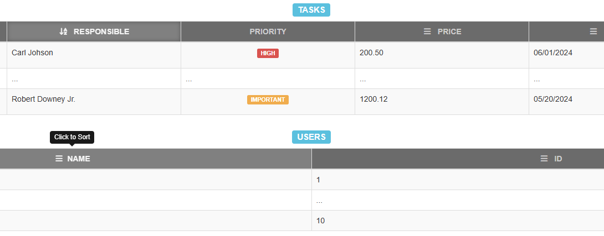

# Table Sorting Buttons Plugin

This plugin allows you to dynamically add sorting buttons to table headers in a web application. It was developed by **Daniel Campos Galdez** and has been successfully used in real systems for the regional electoral court.

The plugin supports Bootstrap 3 or above.
## Features

- **Dynamic Sorting Buttons**: Automatically adds sorting buttons to specified table headers.
- **Local Storage Integration**: Remembers sorting preferences (column, data type, and direction) using `localStorage`.
- **Multiple Table Support**: Works seamlessly with multiple tables on the same page.

### Local Storage Parameters
- `fieldName`: Text reference to the data field that the column represents.
- `isNumeric`: Boolean flag to specify if the data type is numeric (`true` if numeric).
- `dirSort`: Direction of sorting (`asc` or `desc`).
- `tableID`: Identifier of the currently sorted table.

## Installation

1. Include the following files in your HTML:
   - `sort-buttons.css` for styling.
   - `sort-buttons.js` for the sorting functionality.

2. Invoke the sorting function by calling:
   - `triggerSorting(tableID, formID);`
   
   where `tableID` is the ID of the table to be sorted, and `formID` is the ID of the form responsible for handling sorting.

## Usage

1. For each table header (`<th>`) in the table that you want to act as a sorting button, add the following attributes:
   - `data-fieldname`: A reference to the field associated with the column.
   - `data-isnumeric="true"`: (Optional) Set to `true` if the column data is numeric.

2. The script will automatically add sorting buttons and style to headers with these attributes, allowing users to click on them.

## [Live Demonstration](link-to-demo)

